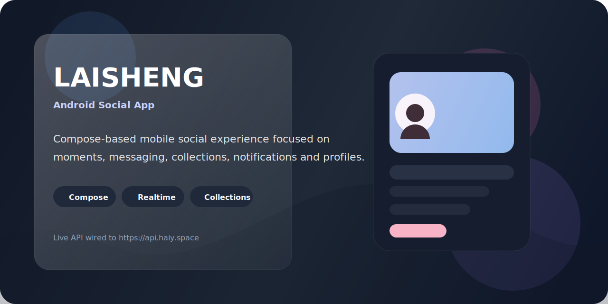

# Laisheng

<p align="center">
  
</p>

<p align="center">
  <strong>一款基于 Jetpack Compose 构建的 Android 社交内容应用。</strong>
</p>

<p align="center">
  围绕动态发布、收藏沉淀、实时私信、互动通知和个人主页组织完整体验，
  目前以真实接口联调和移动端体验优化为主要迭代方向。
</p>

<p align="center">
  
  
  
  
</p>

<p align="center">
  <a href="#overview">Overview</a> ·
  <a href="#features">Features</a> ·
  <a href="#preview">Preview</a> ·
  <a href="#getting-started">Getting Started</a> ·
  <a href="./CONTRIBUTING.md">Contributing</a>
</p>

## Overview

Laisheng 是一个偏内容社区方向的 Android 项目，整体围绕以下体验展开：

- 发现内容：精选流、关注流、搜索用户与搜索动态
- 沉淀内容：点赞、评论、收藏夹、浏览记录
- 建立关系：粉丝、关注、互关、他人主页
- 实时互动：私信、互动通知、消息中心
- 个人成长：会员体系、主页管理、资料编辑

项目目前接入了线上真实后端，默认联调环境为：

```text
https://api.haiy.space
```

## Features

| 模块 | 当前能力 |
| --- | --- |
| 首页 | 精选内容卡片、推荐内容流、跳转详情页 |
| 探索 | 搜索动态、搜索用户、进入他人主页 |
| 发布 | 文本动态、附件上传、发布到线上接口 |
| 详情页 | 点赞、评论、收藏、浏览记录写入 |
| 消息 | 私信会话、聊天详情、消息中心入口 |
| 互动 | 点赞、评论、关注、收藏通知 |
| 我的 | 发布、喜欢、收藏、粉丝、关注、会员、足迹 |
| 社交关系 | 关注切换、粉丝列表、关注列表、互关列表 |

## Tech Stack

- **UI**: Jetpack Compose, Material 3
- **Navigation**: Navigation Compose
- **State**: ViewModel + StateFlow
- **Network**: Retrofit, OkHttp, Gson
- **Image Loading**: Coil, Coil SVG
- **Realtime**: Socket.IO
- **Visual Layer**: Haze

## Preview

当前仓库先放入一张应用界面预览，后续可以继续补首页、消息页和我的页截图。

<p align="center">
  
</p>

## Project Structure

```text
app/src/main/java/com/example/laisheng
├─ data
│  ├─ local
│  ├─ model
│  ├─ remote
│  └─ repository
├─ ui
│  ├─ components
│  ├─ features
│  │  ├─ home
│  │  ├─ explore
│  │  ├─ post
│  │  ├─ message
│  │  ├─ notification
│  │  └─ mine
│  ├─ navigation
│  └─ theme
└─ MainActivity.kt
```

## Getting Started

### Requirements

- Android Studio 最新稳定版
- JDK 21
- Android SDK 35+
- Android 12L 或以上设备 / 模拟器

### Run locally

1. 克隆仓库
2. 用 Android Studio 打开项目
3. 检查根目录 `local.properties`
4. 连接真机或启动模拟器
5. 运行 `app` 模块

默认配置：

```properties
backend.base.url=https://api.haiy.space/
```

该配置会被注入到 `BuildConfig.BASE_URL`。

## API Notes

- 线上接口走 JWT Bearer Token
- 登录后，受保护接口统一带：

```http
Authorization: Bearer <token>
```

- 动态、消息、收藏、关注、通知、会员、浏览记录都已接入真实后端

## Roadmap

- [ ] 补齐仓库展示截图区
- [ ] 统一 README 中英文说明
- [ ] 收敛剩余页面交互细节
- [ ] 增补测试说明与接口排查文档
- [ ] 整理 release 版本发布流程

## Contributing

欢迎一起完善这个项目。

开始前建议先看：

- [CONTRIBUTING.md](./CONTRIBUTING.md)

如果你发现问题或准备提功能：

- 提交 Bug：使用 GitHub Issue 模板
- 提交功能建议：使用 Feature Request 模板
- 提交代码：按 Pull Request 模板说明整理变更

## License

当前仓库暂未单独声明 License。若准备公开分发或接受外部贡献，建议尽快补充。
